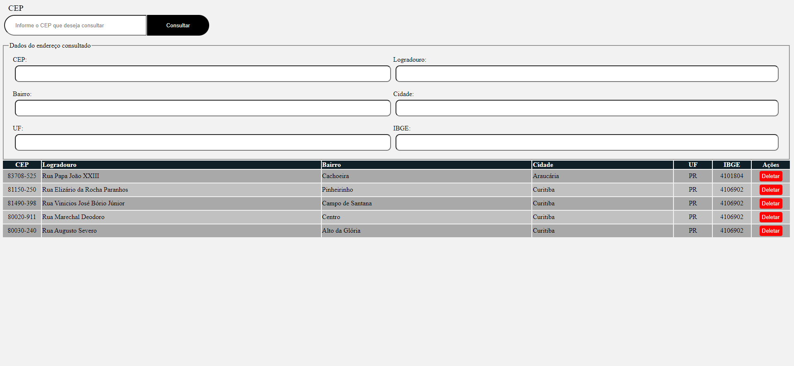

# API-Fetch-CEP

Nesta atividade, tivemos a oportunidade de aplicar nossos conhecimentos em HTML, CSS e JavaScript para criar uma aplicação web interativa. 
O objetivo foi desenvolver uma tela onde o usuário possa inserir um CEP e, ao clicar em um botão, 
a aplicação deve consultar uma API de CEP para obter os dados do endereço correspondente e exibi-los na tela. Além disso, 
tivemos que implementar a funcionalidade de salvar os dados do endereço no Local Storage do navegador.




## Funcionalidades

- Desenvolver uma tela onde o usuário possa inserir um CEP e, ao clicar em um botão.
- Botão para consultar o dados do CEP via API de CEP.
- Exibir as informações na tela
- Botão para salvar os dados no cache do navegador

## Como Usar

1. Clone o repositório:

```bash/cmd ```
git clone https://github.com/rrs-sistema/api-fetch-cep.git
 
<a href="https://rrs-sistema.github.io/api-fetch-cep/" target="_blank">Veja aqui a aplicação funcionando</a>

Abra o arquivo index.html no seu navegador web.

## Consultando CEP

1. Informe um CEP no campo: Informe o CEP que deseja consultar.
2. Clique no botão consultar.
3. Se desejar salvar as informações, clique no botão "Salvar"

## Excluindo CEP cadastrado/salvo no cache do navegador
1. Clique no botão "Deletar" no lado da informação que você deseja deletar".
2. Será aberta uma caixa de alerta perguntando se você deseja realmente deletar.
   2.1 Se sim, clique no botão "Sim".
   2.2 Se não, clique no botão "Não" e a tela será fechada.


Contribuindo
Sinta-se à vontade para contribuir com melhorias neste projeto. Abra um pull request com suas alterações.


